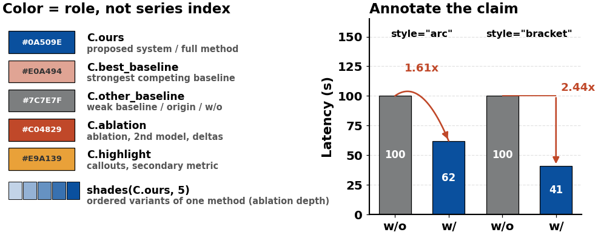
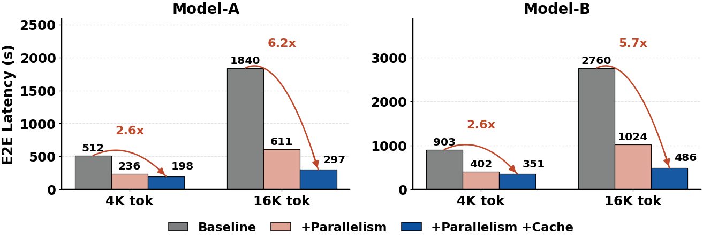
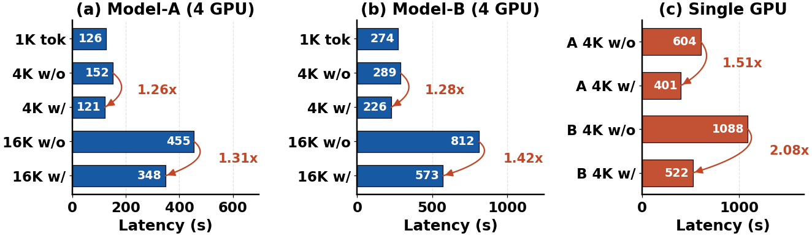
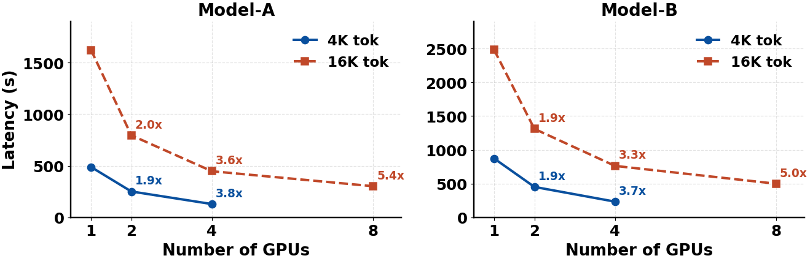
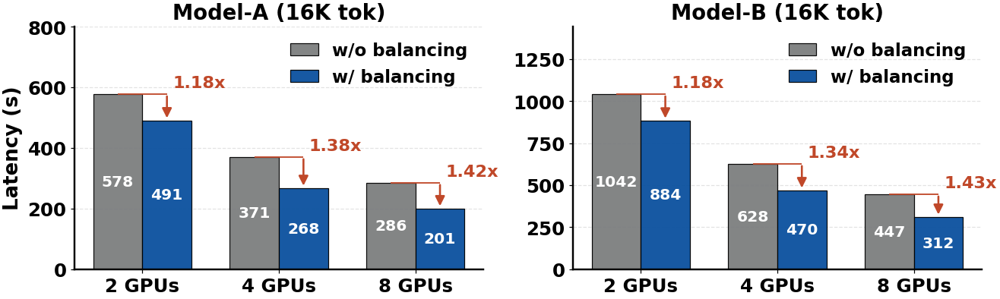
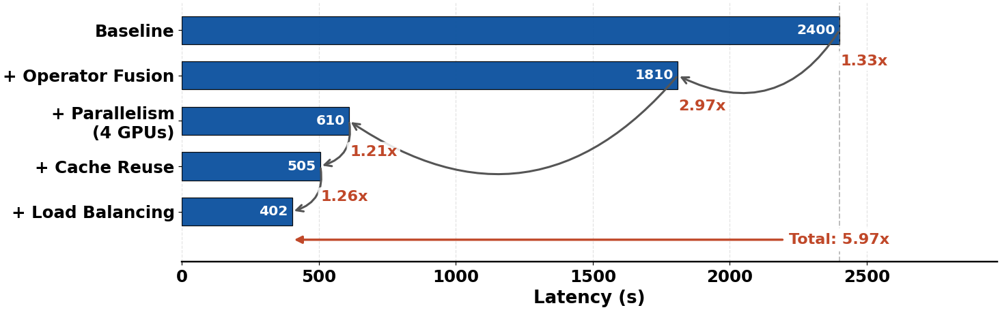
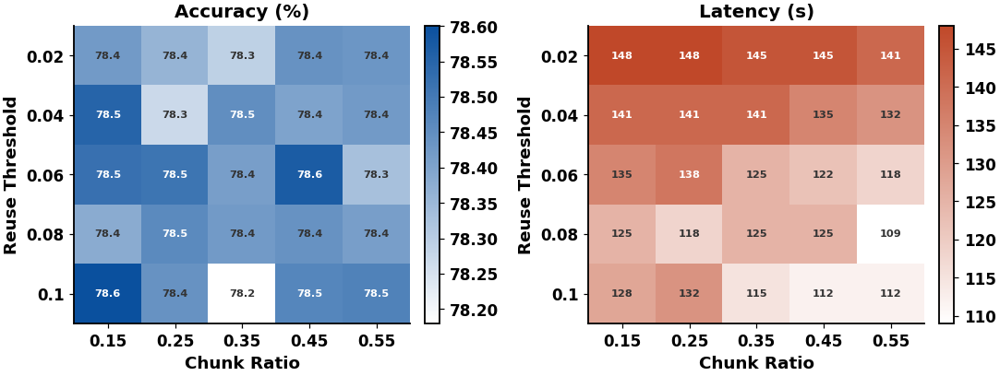
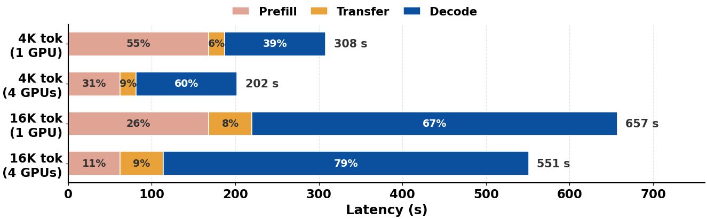
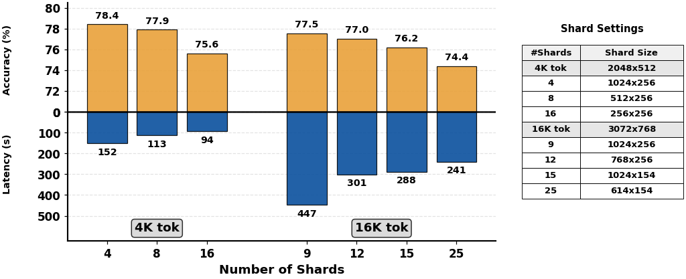

# figure-draw-template

A template repository for **publication-quality matplotlib figures** in systems
and ML papers. Clone it, copy a script, change the numbers.

It packages a house style into a small library (`figkit`), **nine worked
examples — each with its example data and its rendered output** — and the design
rules that make figures survive peer review. Including the one that catches the
most common figure bug: text that prints at 5pt because the canvas was 12 inches
wide and the column is 3.3.



---

## Table of contents

- [Quick start](#quick-start)
- [Gallery — example data in, figure out](#gallery--example-data-in-figure-out)
- [The five ideas](#the-five-ideas)
- [Writing a new figure](#writing-a-new-figure)
- [Adding a figure kind](#adding-a-figure-kind)
- [API reference](#api-reference)
- [Using it in your paper repo](#using-it-in-your-paper-repo)
- [Repository layout](#repository-layout)
- [Working with an AI assistant](#working-with-an-ai-assistant)
- [FAQ](#faq)
- [Credits](#credits)

---

## Quick start

```bash
git clone <this-repo> && cd figure-draw-template
python -m venv .venv && source .venv/bin/activate
pip install -r requirements.txt

make figures          # runs every examples/*.py
open out/previews/    # PNGs to look at;  out/*.pdf goes in the paper
```

Then make your own:

```bash
cp templates/new_figure.py examples/10_my_figure.py
$EDITOR examples/10_my_figure.py     # change the data and the labels
python examples/10_my_figure.py
```

Every run prints how big the text will actually be on the printed page:

```
[figkit] 01_grouped_bar_speedup   14x3.78in   base 17pt -> 8.5pt on page
[figkit] 06_heatmap_ablation      11.2x3.81in base 12pt -> 7.5pt on page
```

No install is required — the examples add the repo root to `sys.path`. If you
prefer, `pip install -e .` and delete that line.

---

## Gallery — example data in, figure out

Nine figure kinds, each a ~60-line script in `examples/`. **Every number below is
synthetic example data** — the point is the shape, not the values. Find the
entry whose *claim* matches yours, copy the script, swap in your numbers.

This section is generated from `examples/*.py` by `make docs`; edit the scripts,
not the README.

---

<!-- BEGIN GALLERY -->
### 1. Grouped bars + speedup arcs — [`01_grouped_bar_speedup.py`](examples/01_grouped_bar_speedup.py)

> **Claim:** "Our full system is 6.2x faster than the baseline, and both optimizations pull their weight."

```python
SETTINGS = ["4K tok", "16K tok"]
VARIANTS = ["Baseline", "+Parallelism", "+Parallelism +Cache"]
MODEL_A  = {"4K tok": [512, 236, 198],  "16K tok": [1840, 611, 297]}   # seconds
MODEL_B  = {"4K tok": [903, 402, 351],  "16K tok": [2760, 1024, 486]}
```



The workhorse end-to-end figure: 2-4 systems across 2-4 settings, one arc per setting carrying the headline ratio, one shared legend below both panels.

---

### 2. Horizontal bars, multi-panel — [`02_hbar_panels.py`](examples/02_hbar_panels.py)

> **Claim:** "Caching helps at every sequence length, and helps most where it costs most."

```python
SETTINGS   = ["1K tok", "4K w/o", "4K w/", "16K w/o", "16K w/"]
MODEL_A    = [126, 152, 121, 455, 348]         # seconds, 4 GPUs
MODEL_B    = [274, 289, 226, 812, 573]
SINGLE_GPU_LABELS = ["A 4K w/o", "A 4K w/", "B 4K w/o", "B 4K w/"]
SINGLE_GPU = [604, 401, 1088, 522]
```



Long setting names become y labels instead of rotated x-ticks. Values sit *inside* the bars; the arcs bow sideways into whitespace reserved by `headroom(axis="x")`. Panels get unequal widths via `width_ratios`.

---

### 3. Scaling lines + ratio labels — [`03_scaling_lines.py`](examples/03_scaling_lines.py)

> **Claim:** "We scale near-linearly to 4 GPUs and still gain at 8."

```python
MODEL_A = {"4K tok":  {1: 488, 2: 251,  4: 129},          # {workload: {gpus: seconds}}
           "16K tok": {1: 1622, 2: 795, 4: 447, 8: 302}}
MODEL_B = {"4K tok":  {1: 872, 2: 451,  4: 233},
           "16K tok": {1: 2480, 2: 1310, 4: 762, 8: 498}}
```



Each point is labelled with its speedup over that series' first point, so the reader never has to divide numbers in their head. Series may have different x support -- the 8-GPU point exists only for the long-sequence workload, and that is fine.

---

### 4. Paired bars + bracket deltas — [`04_paired_bars_delta.py`](examples/04_paired_bars_delta.py)

> **Claim:** "Load balancing wins at every GPU count, and the win grows."

```python
GROUPS  = ["2 GPUs", "4 GPUs", "8 GPUs"]
MODEL_A = {"w/o": [578, 371, 286], "w/": [491, 268, 201]}   # seconds
MODEL_B = {"w/o": [1042, 628, 447], "w/": [884, 470, 312]}
```



The single-ablation figure. An L-shaped bracket reads as "this much was removed" in a way a curved arc does not; values sit mid-bar because the bracket occupies the space above.

---

### 5. Cascade breakdown — [`05_cascade_breakdown.py`](examples/05_cascade_breakdown.py)

> **Claim:** "Here is where the 6.0x comes from, technique by technique."

```python
STEPS   = ["Baseline", "+ Operator Fusion", "+ Parallelism\n(4 GPUs)",
           "+ Cache Reuse", "+ Load Balancing"]
LATENCY = [2400, 1810, 610, 505, 402]          # seconds, worst -> best
```



The most persuasive figure in a systems paper: it decomposes the headline number and shows no single trick is doing all the work. `cascade()` chains the arcs; `total_arrow()` carries the number people will quote.

---

### 6. Paired heatmaps — [`06_heatmap_ablation.py`](examples/06_heatmap_ablation.py)

> **Claim:** "Accuracy is flat across the sweep, so pick the configuration that is fastest."

```python
THRESHOLDS = [0.02, 0.04, 0.06, 0.08, 0.10]     # rows: reuse threshold
RATIOS     = [0.15, 0.25, 0.35, 0.45, 0.55]     # columns: chunk ratio

ACCURACY = np.array([                            # %
    78.42, 78.36, 78.29, 78.44, 78.43,
    78.55, 78.27, 78.45, 78.40, 78.42,
    78.52, 78.51, 78.41, 78.57, 78.33,
    78.38, 78.46, 78.42, 78.44, 78.41,
    78.60, 78.44, 78.18, 78.47, 78.48,
]).reshape(5, 5)
LATENCY = np.array([                             # seconds
    148, 148, 145, 145, 141,
    141, 141, 141, 135, 132,
    135, 138, 125, 122, 118,
    125, 118, 125, 125, 109,
    128, 132, 115, 112, 112,
]).reshape(5, 5)
```



A two-parameter sweep showing what you gain *and* what you pay -- one heatmap alone always invites "but what did it cost?". White-to-role-color ramps keep it inside the paper's color language; cell text flips black/white automatically.

---

### 7. Stacked breakdown — [`07_stacked_breakdown.py`](examples/07_stacked_breakdown.py)

> **Claim:** "Decode dominates, so that is what we optimized."

```python
CONFIGS   = ["4K tok\n(1 GPU)", "4K tok\n(4 GPUs)",
             "16K tok\n(1 GPU)", "16K tok\n(4 GPUs)"]
PARTS     = ["Prefill", "Transfer", "Decode"]
BREAKDOWN = [[168, 19, 121],       # seconds per part, one row per config
             [ 62, 19, 121],
             [168, 52, 437],
             [ 62, 52, 437]]
```



Percentages inside the segments, absolute totals at the end of the bar: answers "what dominates?" and "how big is it?" in one panel. A motivation figure -- it justifies the rest of the paper before you present a solution.

---

### 8. Trade-off, mirrored — [`08_tradeoff_mirror.py`](examples/08_tradeoff_mirror.py)

> **Claim:** "Past 8 shards you pay real accuracy for little speed."

```python
DATA = {
    "4K tok":  {"shards": [4, 8, 16], "accuracy": [78.42, 77.91, 75.63],
                "latency": [152, 113, 94],
                "shard_size": ["1024x256", "512x256", "256x256"]},
    "16K tok": {"shards": [9, 12, 15, 25], "accuracy": [77.55, 77.02, 76.21, 74.38],
                "latency": [447, 301, 288, 241],
                "shard_size": ["1024x256", "768x256", "1024x154", "614x154"]},
}
BASE_SHARD     = {"4K tok": "2048x512", "16K tok": "3072x768"}
ACCURACY_RANGE = (70, 80)      # round endpoints -> round tick labels
LATENCY_RANGE  = (0, 500)
```



Accuracy up, cost down, one shared x axis, so the *knee* is visible instead of the reader having to align two charts. The settings table is pinned beside the panel for the detail that would bloat the caption.

---

### 9. Style card — [`09_style_reference.py`](examples/09_style_reference.py)

> **Claim:** Not a paper figure: every color role and every annotator in one image.


Not a paper figure: every color role and every annotator in one image (shown at the top of this README). Regenerate it after editing `figkit/palette.py` to see what you changed. Print it and pick from it instead of inventing a color per figure.

---

<!-- END GALLERY -->

## The five ideas

Everything else in this repo follows from these.

### 1. A figure is an argument, not a data dump

Write the claim before the code. Every example's docstring starts with

```python
"""Figure 4 -- With vs. without: paired bars + bracket deltas.

CLAIM  "Workload rebalancing wins at every GPU count, and the win grows."
```

If you cannot write that sentence, the figure is not ready to be drawn. And
since the claim is usually a *relationship* ("5.5x"), not a number, every
annotator in `figkit` connects two data points and labels the ratio between
them:

```python
fk.speedup_between_bars(ax, bars, 0, 2, fmt="{:.2f}x")   # draws "5.53x"
```

### 2. Color means a role, not a series index

`C.ours` is the same deep blue in Figure 3 and Figure 11. A reader who learned
the mapping once reads every later figure faster.

```python
colors = [fk.C.other_baseline, fk.C.best_baseline, fk.C.ours]   # good
colors = ["#1f77b4", "#ff7f0e", "#2ca02c"]                      # you just
                                                                # invented a
                                                                # new language
```

Roles: `ours` (deep blue), `best_baseline` (salmon), `other_baseline` (gray),
`ablation` (brick red), `highlight` (amber). Degrees of the same method use
`shades(C.ours, n)` — one hue, varying lightness — not five unrelated hues.

### 3. Size the canvas backwards from the printed page

```
effective_pt = font_size * (page_width_in / figsize_width_in)
```

An 18pt label on a 12-inch canvas dropped into a 3.33-inch ACM column prints at
**5pt**. This is the single most common figure bug in submitted papers, and it
is invisible until you print.

```python
p = fk.plan("acm-sigplan-text", aspect=0.27, target_pt=8.5)
fk.apply_style(fk.FigureStyle(font_size=p.font_size))
fig, axes = plt.subplots(1, 2, figsize=p.figsize)
...
fk.save(fig, "e2e_latency", plan=p)     # prints the on-page point size
```

`plan()` inverts the formula; `save()` re-checks it on every run and warns below
6pt. Aim for 8pt, treat 7pt as the camera-ready floor.

Every secondary label size is a *fraction* of the base font
(`figkit.style.REL`), so changing `font_size` rescales the whole figure in
proportion and nothing silently becomes unreadable.

### 4. Wide and short

Vertical space is the scarce resource in a paper. Aspect 0.25-0.35, 1xN panel
strips rather than 2x2 grids, value labels *inside* bars where they cost no
headroom, one shared legend below the figure rather than one per panel.

### 5. One script per figure, no manual touch-ups

Data as literals at the top (or loaded from `data/`), one `main()`, one
`fk.save()`. When a reviewer asks about a number, the fix is a one-line edit and
`make figures` — not an afternoon of re-doing an Illustrator edit nobody
documented.

---

## Writing a new figure

```bash
cp templates/new_figure.py examples/10_my_figure.py
```

The template has five numbered sections, in the order you should fill them:

```python
# 1. data      -- literals at the top, in the units the axis will show
# 2. canvas    -- fk.plan(...) + fk.apply_style(...) + plt.subplots(figsize=...)
# 3. draw      -- one fk.<chart>(...) call
# 4. annotate  -- limits FIRST, then speedups/labels
# 5. save      -- fk.save(fig, "name", plan=p)
```

Two rules that cause most of the debugging if broken:

1. **Set axis limits before annotating.** Curved connectors size their bow from
   the current limits.
2. **Call `apply_style()` inside each figure function.** rcParams are global and
   sticky; a script that builds four figures at different densities must reset
   between them.

Then check it against the list in
[docs/DESIGN_GUIDE.md](docs/DESIGN_GUIDE.md#checklist-before-you-paste-the-pdf-into-the-paper).

---

## Adding a figure kind

The set is meant to grow. Adding one is a single file plus one command:

```bash
make new NAME=10_throughput     # scaffolds examples/10_throughput.py from the template
$EDITOR examples/10_throughput.py
make gallery                    # renders it, refreshes docs/gallery/, regenerates the docs
```

The script carries everything the docs need, so nothing is maintained by hand:

```python
META = {                       # -> README gallery entry + docs/RECIPES.md row
    "title":   "10. Throughput vs. latency",
    "claim":   '"We sustain 3.1x the throughput at equal p99 latency."',
    "use":     "when a single number hides a trade-off",
    "helpers": "`scaling_lines` + `reference_line`",
    "notes":   "Two or three lines of why-this-shape for the README.",
}

# >>> data                     # -> lifted verbatim into the README, next to the image
BATCH      = [1, 2, 4, 8]
BASELINE   = [120, 210, 380, 410]      # req/s
OURS       = [380, 650, 1180, 1290]
# <<< data
```

`tools/build_docs.py` parses `META` and the data block out of every
`examples/*.py` (with `ast`, without importing them) and rewrites the sections
between the `<!-- BEGIN GALLERY -->` / `<!-- BEGIN RECIPES -->` markers. The
README therefore always shows the data that actually produced the image beside
it, and the recipes table can never drift from the scripts.

If the shape needs a new primitive, add it to `figkit/charts.py` or
`figkit/annotate.py`, export it from `figkit/__init__.py`, and document it in
the API table below — never copy-paste a variant into a figure script.

---

## API reference

Import once: `import figkit as fk`.

### Style

| Call | What it does |
|---|---|
| `fk.apply_style(style)` | Set global rcParams. `style` is a `FigureStyle` or a preset name. Call per figure. |
| `fk.FigureStyle(font_size, axes_linewidth, bold_text, use_tex, font_family, grid_alpha)` | The knobs. |
| `fk.PRESETS` | `"paper"`, `"paper_dense"`, `"slide"`, `"serif"`. |
| `fk.grid(ax, axis="y")` | House grid on one axis, behind the data. |
| `fk.despine(ax, left=True)` | Drop the left spine (horizontal bar charts). |
| `fk.bold_ticks(ax)` | Force bold tick labels. |
| `fk.rel_fontsize(0.78)` | A size relative to the current base font. |

### Sizing

| Call | What it does |
|---|---|
| `fk.plan(layout, aspect, target_pt, oversample, frac)` | Canvas + font size for a chosen on-page point size. Returns `.figsize`, `.font_size`. |
| `fk.LAYOUTS` | Printed widths: `acm-sigplan-col/-text`, `ieee-col/-text`, `usenix-*`, `neurips`, `icml`, `slide-16x9`. |
| `fk.effective_pt(font_size, fig_w, layout)` | What the reader sees. |
| `fk.font_size_for(target_pt, fig_w, layout)` | The inverse. |
| `fk.report(font_size, fig_w, layout)` | One-line readability verdict. |
| `fk.set_layout(name)` | Project-wide default for the `save()` report. |

### Palette

| Call | What it does |
|---|---|
| `fk.C.ours` / `.best_baseline` / `.other_baseline` / `.ablation` / `.highlight` | The five roles. |
| `fk.RICE`, `fk.PALETTE` | The same as dicts, plus extended hues. |
| `fk.shades(color, n)` | n tints of one hue, light to dark. |
| `fk.ORDINAL_BLUE` | Ramp for a magnitude (1/2/4/8). |
| `fk.sequential_cmap(color)` | White -> color, for heatmaps. |
| `fk.diverging_cmap(low, mid, high)` | For data with a meaningful zero. |
| `fk.text_on(color)` | Readable text color for that background. |

### Charts

| Call | Shape |
|---|---|
| `fk.grouped_bar(ax, categories, series, labels, colors)` | Vertical grouped bars. |
| `fk.hbar(ax, labels, values, color)` | Horizontal bars, first label on top. |
| `fk.paired_bar(ax, groups, before, after)` | Two bars per group (with/without). |
| `fk.stacked_hbar(ax, labels, matrix, parts)` | Composition, % inside + totals outside. |
| `fk.scaling_lines(ax, {name: {x: y}})` | Lines with per-point ratio labels. |
| `fk.heatmap(ax, matrix, xticklabels, yticklabels)` | Annotated matrix, auto text contrast. |
| `fk.mirror_bars(ax, positions, up, down, up_range, down_range)` | Two metrics, one axis. |
| `fk.side_table(ax, rows, col_labels)` | Small table on its own axis. |

### Annotate

| Call | What it draws |
|---|---|
| `fk.speedup(ax, src, dst, style=...)` | Connector + ratio label. `style`: `"arc"`, `"bracket"`, `"straight"`. Returns the ratio. |
| `fk.speedup_between_bars(ax, bars, i, j)` | The same, addressed by bar index. |
| `fk.cascade(ax, values)` | Chained arcs down a ladder of cumulative gains. |
| `fk.total_arrow(ax, start, end, offset)` | One arrow with the headline total. |
| `fk.bar_labels(ax, bars, where=...)` | Values `"outside"`/`"inside"`/`"mid"`, with `shift`/`ha` overrides. |
| `fk.headroom(ax, 0.3)` | Grow the axis so labels and arcs fit. |
| `fk.panel_titles(axes, titles)` | "(a) ...", "(b) ...". |
| `fk.legend_below(fig, handles, labels)` | One shared legend under the figure. |
| `fk.patch_handles(colors, labels)` | Legend handles for artists nobody owns. |
| `fk.reference_line(ax, value)` | Dashed baseline marker. |

### Output

| Call | What it does |
|---|---|
| `fk.save(fig, name, plan=p)` | `out/name.pdf` + `out/previews/name.png`, and the readability report. |
| `fk.set_output_dir(out, preview)` | Point at your paper's `figures/`. |
| `fk.quiet()` | Silence the report. |

---

## Using it in your paper repo

Two options.

**Vendored (simplest).** Copy `figkit/` and `templates/new_figure.py` into your
paper repo's `plots/` directory, then:

```python
fk.set_output_dir("../figures", "previews")     # PDFs land next to the .tex
```

**Submodule.** `git submodule add <this-repo> plots/figure-template` and add it
to `sys.path`. Upgrades come with `git submodule update --remote`.

Either way, wire it into the build:

```makefile
figures:
	python plots/fig_*.py
paper: figures
	latexmk -pdf main.tex
```

Details, column widths, and how to save space when you are over the page limit:
[docs/LATEX.md](docs/LATEX.md).

---

## Repository layout

```
figkit/                  the library (~1400 lines, nothing beyond matplotlib + numpy)
  style.py               apply_style, FigureStyle, PRESETS, grid/despine/bold_ticks
  palette.py             RICE roles, C.*, shades, colormaps, text_on
  sizing.py              plan(), LAYOUTS, effective_pt -- the on-page math
  charts.py              grouped_bar, hbar, paired_bar, stacked_hbar,
                         scaling_lines, heatmap, mirror_bars, side_table
  annotate.py            speedup, cascade, total_arrow, bar_labels, headroom, ...
  io.py                  save() -> pdf + preview png + readability report
examples/                nine worked figures; copy the closest one
                         (each carries a META block + a `# >>> data` block)
templates/new_figure.py  the blank you actually start from (`make new NAME=...`)
tools/build_docs.py      regenerates the README gallery + RECIPES from examples/
data/                    example JSON inputs for data-driven figures
docs/
  DESIGN_GUIDE.md        why the defaults are what they are + a pre-submit checklist
  RECIPES.md             claim -> figure -> helper, and the anti-patterns
  LATEX.md               includegraphics, column widths, fonts, saving space
  TROUBLESHOOTING.md     the failure modes you will actually hit
  gallery/               the PNGs this README links to (regenerate: make gallery)
skills/paper-figure/     instructions for an AI assistant working in this repo
out/                     generated; gitignored
```

---

## Working with an AI assistant

`skills/paper-figure/SKILL.md` states the conventions in a form an assistant
(Claude Code, Cursor, Copilot) can follow. A prompt that works:

```
Create a new figure script at examples/10_throughput.py following the
conventions in skills/paper-figure/SKILL.md and docs/DESIGN_GUIDE.md.

Claim: "our scheduler sustains 3.1x the throughput of the baseline at
        every batch size."
Data:  batch sizes 1/2/4/8; baseline 120/210/380/410 req/s;
       ours 380/650/1180/1290 req/s.
Target: a figure* spanning both columns in an ACM sigplan paper.

Use figkit (fk.plan, fk.scaling_lines or fk.grouped_bar, fk.speedup, fk.save).
Run it and show me out/previews/10_throughput.png.
```

Two things to insist on: that it uses `fk.plan()` rather than picking a
`figsize` by feel, and that it *runs* the script and looks at the preview before
declaring victory.

---

## FAQ

**Why not seaborn / plotnine?** Both are excellent for exploration. For a paper
you need pixel-level control over annotation placement, and every one of these
figures needs at least one thing the grammar does not express (an arc between
two specific bars, a mirrored axis, a table pinned to a panel). matplotlib plus
a thin layer is less fighting.

**Why is everything bold?** It survives being shrunk to column width, which is
where these figures live. Turn it off with
`FigureStyle(bold_text=False)` if your figure prints near full size.

**Can I use my own colors?** Yes — edit `figkit/palette.py` once, and every
figure in the paper changes together. That is the whole point. Do not hardcode a
hex in one script.

**Serif, to match the paper body?** `fk.apply_style("serif")`. Sans-serif is
the default because it stays legible at 7-8pt where a serif face muddies.

**Does it work for slides?** `fk.apply_style("slide")` and
`fk.plan("slide-16x9", aspect=0.5, target_pt=18)`. Bump `target_pt` a lot —
slide text is read from three metres away.

**Does it do system diagrams / architecture figures?** No. Those are for
Illustrator, Figma, or TikZ. This is for anything driven by measurements.

---

## Credits

The style conventions build on
[ChenLiu-1996/figures4papers](https://github.com/ChenLiu-1996/figures4papers)
(Chen Liu, Yale) and its `scientific-figure-pro` skill, which is where the
semantic-palette idea and the `apply_publication_style` / `finalize_figure`
workflow come from. `figkit` keeps both of those names as aliases so scripts
written against that module port over unchanged.

The chart shapes and annotation vocabulary are generalized from the evaluation
sections of systems papers. All data in `examples/` is synthetic.

MIT licensed — see [LICENSE](LICENSE).
